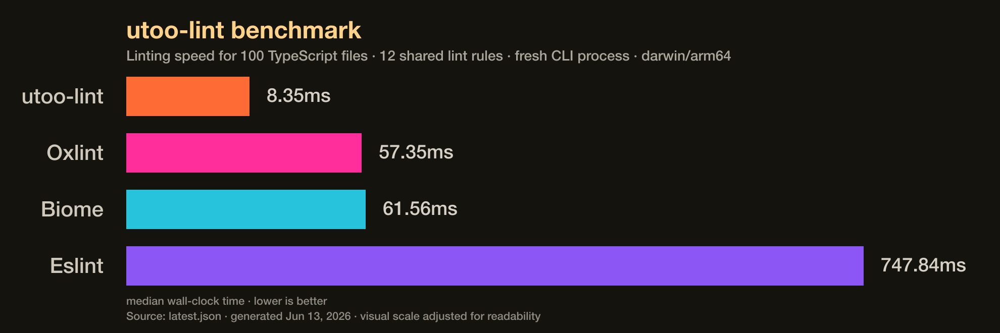

# utoo-lint


`@utoo/lint` is a High performance linter for JavaScript and TypeScript written by Zig.
It uses [`yuku`](https://github.com/yuku-toolchain/yuku) for parsing, AST
traversal, scope tracking, and symbol resolution.

It currently has some performance advantages compared with other lint tools:



## Status

This repo is a working scaffold, not a production linter yet.

- License: [MIT](LICENSE)
- Security: See the [security policy](SECURITY.md) to report vulnerabilities
  privately.

Useful docs:

- [Rule status](docs/rule-status.md) lists implemented rules and their ESLint
  documentation links.
- [Configuration](docs/configuration.md) describes `utoo.json` files for
  frontend projects.
- [Migrating from ESLint](docs/eslint-migration.md) covers the current migration
  path.
- [Contributing](CONTRIBUTING.md) covers local development, rule work,
  packaging, and publishing.

## Install

```bash
pnpm add -D @utoo/lint
```

Run it with:

```bash
pnpm exec utoo-lint src
```

## CLI

```bash
utoo-lint [options] [file-or-directory ...]
```

If no target is provided, `utoo-lint` scans the current directory. It skips
`.git`, `.zig-cache`, `node_modules`, `vendor`, and `zig-out`.

Start a frontend project from the packaged template:

```bash
cp node_modules/@utoo/lint/configs/frontend.json utoo.json
pnpm exec utoo-lint src
```

Run only a focused rule set:

```bash
utoo-lint --rules=no-debugger,no-unused-vars,@typescript-eslint/no-unused-vars src
```

Disable a rule from the command line:

```bash
utoo-lint --no-console=off src
```

Use machine-readable output:

```bash
utoo-lint --format=json src
```

### Autofix

Apply safe fixes from all enabled rules that support autofix:

```bash
pnpm exec utoo-lint --fix src
```

Preview the result without changing files:

```bash
pnpm exec utoo-lint --fix-dry-run --format=json src
```

`--fix` writes fixed source back to disk. `--fix-dry-run` never writes files;
with JSON output, changed sources are returned in the `outputs` array. Fixes run
until the source is stable, subject to a safety pass limit. Diagnostics remain
when a rule or a particular code shape cannot be fixed safely. See
[Rule status](docs/rule-status.md) for per-rule autofix coverage.

## Configuration

By default, `utoo-lint` reads `utoo.json` or `utoo-lint.json` from the current
directory or its ancestors. Use `--config=path/to/utoo.json` for an explicit file or
`--no-config` to ignore local config.

```json
{
  "$schema": "https://raw.githubusercontent.com/fireairforce/utoo-lint/main/npm/utoo-lint/schema.json",
  "files": ["src/**/*.{js,jsx,ts,tsx}"],
  "ignores": ["dist", "node_modules"],
  "rules": {
    "no-console": "off",
    "no-debugger": "error",
    "@typescript-eslint/no-unused-vars": ["warn"]
  }
}
```

Rule values may be `off`, `warn`, `error`, `0`, `1`, `2`, booleans, or an
ESLint-style array whose first item is the severity and later items are native
rule options.

To migrate an existing ESLint config into the native utoo format:

```bash
pnpm exec utoo-lint migrate eslint --from eslint.config.js --output utoo.json
```

## JavaScript API

```js
import { lintFiles } from "@utoo/lint";

const report = lintFiles(["src"], {
  config: "utoo.json",
  rules: ["no-debugger"]
});
```

Set `fix: true` to compute fixed output without writing files:

```js
const report = lintFiles(["src"], { fix: true });

console.log(report.outputs);
```

## Architecture

- `src/root.zig` owns parsing, rule execution, and public API exports.
- `src/core.zig` owns shared lint types, diagnostics, and common helpers.
- `src/rules/root.zig` registers rules and dispatches AST visitor hooks.
- `src/rules/*.zig` contains one lint rule per file.
- `src/main.zig` owns CLI argument parsing, file discovery, and terminal output.
- `vendor/yuku` is pinned as a git submodule so the parser API is reproducible.

The current rule engine deliberately uses Yuku's native flat AST and semantic
traverser instead of converting to ESTree. That keeps the first version small
and avoids a JS runtime dependency.
